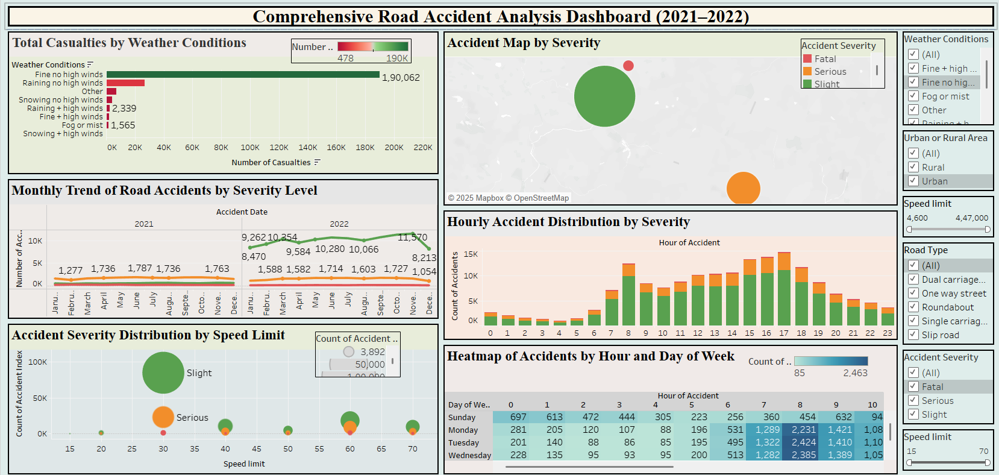

# 🚦 Road Accident Analysis Dashboard (2021–2022)

## 📊 Project Overview
This dashboard provides an interactive and data-driven analysis of road accidents that occurred between 2021 and 2022. It offers visual insights into when, where, and why road accidents happen based on factors such as time, weather, road type, speed limits, and accident severity.

## ❗ Business Problem
Road accidents result in significant human and economic loss. Government agencies, city planners, and traffic departments need a clear understanding of accident trends and risk factors to reduce accidents and improve road safety.

## 🎯 Objective
To create an interactive dashboard that enables stakeholders to:
- Analyze accident trends over time.
- Understand the impact of weather, speed limits, and road types on accident severity.
- Identify high-risk times and accident hotspots.
- Make informed policy and safety decisions.

## 🖼️ Dashboard Preview

## 📈 Key Visuals & Descriptions

### 1. **Monthly Trend of Road Accidents (Line Chart)**
Tracks monthly accident counts by severity to identify trends and seasonal spikes.

### 2. **Accident Severity by Speed Limit (Bubble Chart)**
Visualizes accident count and severity by speed limit—severe accidents increase at higher limits.

### 3. **Accidents by Day and Hour (Heatmap)**
Reveals peak times for accidents, helping in planning traffic regulation.

### 4. **Weather Conditions vs. Casualties (Bar Chart)**
Shows how casualties vary across weather types—foggy/rainy conditions lead to more severe incidents.

### 5. **Urban vs Rural Accidents (Filter & Map)**
Highlights patterns based on area type—rural accidents tend to be more severe.

### 6. **Road Type and Accident Severity (Bar Chart)**
Identifies road types with higher accident severity for better infrastructure planning.

### 7. **Accident Map by Severity (Mapbox Geo Map)**
Pinpoints accident hotspots by severity for targeted action.

## 🔎 Filters (Interactivity)
The dashboard includes multiple interactive filters:
- ✅ Weather Conditions  
- ✅ Urban or Rural Area  
- ✅ Speed Limit Range  
- ✅ Road Type  
- ✅ Accident Severity

## 💡 Business Insights
- **Fine weather** has the highest accident count; **bad weather** correlates with higher severity.
- Most accidents occur during **office hours**.
- **Urban areas** have more accidents; **rural accidents** are deadlier.
- **High-speed roads** have more severe outcomes.

## 🛠️ Tools Used
- **Tableau** – For data visualization  
- **Microsoft Excel** – For data cleaning  
- **OpenStreetMap** – For geo-mapping in Tableau
- 

## ▶️ How to Use
1. Open the Tableau dashboard (`.twbx` file) in Tableau Public or Desktop.
2. Use filters to explore by severity, speed limit, time, road type, and weather.
3. Hover over charts to see detailed tooltips.
4. Zoom and interact with the accident map to locate hotspots.

## 👩‍💻 About Me
**Neha Thakur**  
Postgraduate in Computer Science | Aspiring Data Analyst  
Skilled in SQL, Tableau, Power BI, Python, Excel  
Passionate about turning data into impactful stories.

📧 Email: [nehaathakurnehaathakur92@gmail.com](mailto:nehaathakurnehaathakur92@gmail.com)  
🔗 LinkedIn: [linkedin.com/in/nehathakur8](https://www.linkedin.com/in/nehathakur8)

